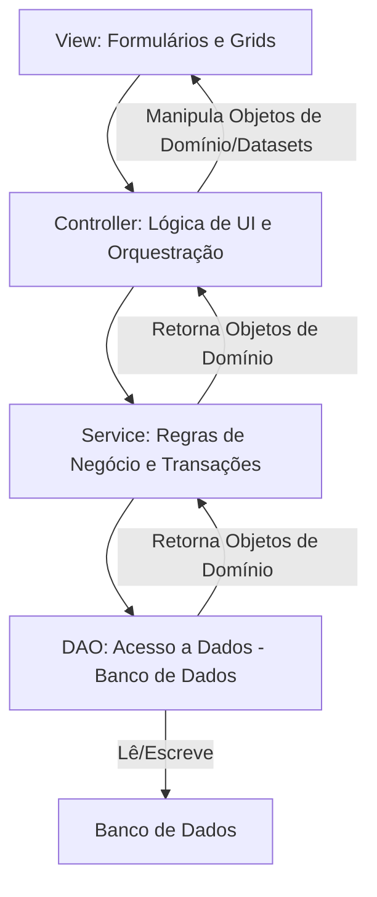
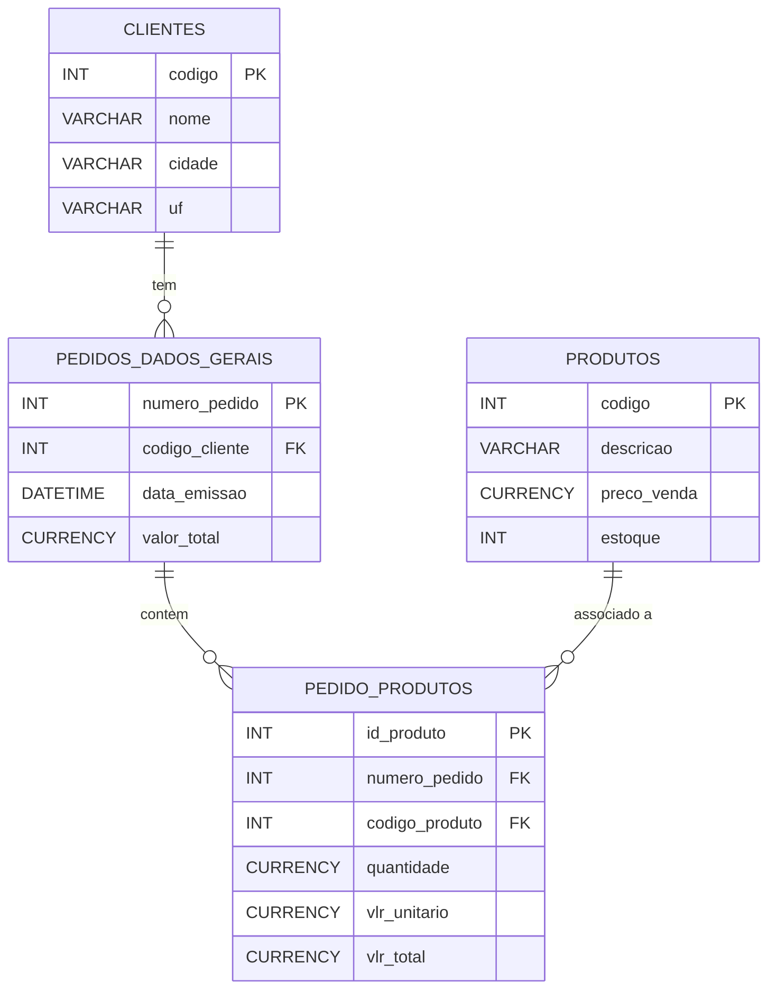

# README TesteWK

# Projeto de Pedido de Vendas
Este documento detalha a arquitetura, as camadas e a estrutura do banco de dados do projeto de Pedido de Vendas, desenvolvido em Delphi. O objetivo é fornecer uma visão clara do sistema, facilitando a manutenção e futuras expansões.

## 1. Visão Geral do Projeto
O projeto "Pedido de Vendas" é uma aplicação desenvolvida em Delphi que visa gerenciar o processo de registro e consulta de pedidos. A aplicação segue um padrão de arquitetura limpa, promovendo a separação de responsabilidades e a manutenibilidade do código.

## 2. Arquitetura do Sistema: Camadas M.V.C
A arquitetura do projeto é dividida em camadas lógicas, onde cada camada possui responsabilidades bem definidas, comunicando-se de forma controlada para garantir a coesão e baixo acoplamento.

### 2.1. Diagrama de Camadas
Aqui está um diagrama que ilustra a interação entre as principais camadas da aplicação:

Snippet de código

### Explicação das Camadas:
### View (Interface do Usuário):

* Responsabilidade: Apresentar informações ao usuário e capturar suas interações.

* Componentes: Formulários (TForm), Grades (TDBGrid), Campos de Edição (TEdit), Botões (TButton), etc.

* Comunicação: Envia ações do usuário para o Controller e recebe dados para exibição. Não contém lógica de negócio diretamente.

### Controller (Controle da Lógica da UI):

* Responsabilidade: Gerenciar o fluxo de dados entre a View e a camada de Serviço. Orquestra a resposta às ações do usuário e prepara os dados para a View.

* Componentes: Classes com métodos para manipular dados e estados da View.

* Comunicação: Recebe requisições da View, chama métodos do Service e retorna dados (geralmente em formato de objetos de domínio ou TDataSet/TFDMemTable) para a View.

### Service (Regras de Negócio):

* Responsabilidade: Implementar as regras de negócio complexas, validações e orquestrar transações. Garante que os dados sejam consistentes e sigam as regras do negócio.

* Componentes: Classes que contêm a lógica de negócio principal.

* Comunicação: Recebe objetos do Controller, invoca métodos do DAO para persistência/recuperação e retorna objetos de domínio ao Controller. Não tem conhecimento direto da View.

### DAO (Data Access Object):

* Responsabilidade: Abstrair a lógica de acesso ao banco de dados. Realiza operações CRUD (Criar, Ler, Atualizar, Deletar) para objetos de domínio específicos.

* Componentes: Classes específicas para cada entidade (ex: TPedidoDAO, TClienteDAO). Utiliza componentes como TFDQuery, TFDConnection.

* Comunicação: Recebe objetos do Service, executa comandos SQL e mapeia os resultados do banco de dados para objetos de domínio (ou TDataSet/TFDDataSet) e vice-versa.

### Domínio/Model:

* Responsabilidade: Representar as entidades de negócio (ex: TPedido, TCliente, TPedidoProduto). São classes simples que contêm apenas propriedades e, opcionalmente, comportamentos inerentes à própria entidade (como validações básicas).

* Componentes: Classes como TPedido, TCliente, TPedidoProduto.

* Comunicação: São os objetos que transitam entre as camadas de Service e Controller.

## 3. Estrutura do Banco de Dados
O banco de dados armazena as informações essenciais para o funcionamento da aplicação, incluindo pedidos, itens de pedido e clientes.

### 3.1. Diagrama ER Simplificado
Aqui está um diagrama de relacionamento de entidades (ERD) simplificado do banco de dados, mostrando as principais tabelas e seus relacionamentos:

### Explicação das Tabelas:

### CLIENTES: Armazena informações sobre os clientes.
* codigo: Identificador único do cliente.
* nome: Nome completo do cliente.
* cidade: Cidade de contato.
* uf: Estado do cliente.

### PEDIDOS_DADOS_GERAIS: Armazena os cabeçalhos dos pedidos.
* numero_pedido: Identificador único do pedido.
* codigo_cliente: Chave estrangeira para a tabela CLIENTES.
* data_emissao: Data em que o pedido foi realizado.
* valor_total: Valor total do pedido.

### PEDIDO_PRODUTOS: Armazena os itens de cada pedido (ligação entre pedidos e produtos).
* id_produto: Identificador único do item do pedido.
* numero_pedido: Chave estrangeira para a tabela PEDIDOS_DADOS_GERAIS.
* codigo_produto: Chave estrangeira para a tabela PRODUTOS.
* quantidade: Quantidade do produto no pedido.
* vlr_unitario: Valor unitário do produto no momento do pedido.
* vlr_total: Valor total do item (quantidade * vlr_unitario).

### PRODUTOS: Armazena informações sobre os produtos.
* codigo: Identificador único do produto.
* descricao: Descrição do produto.
* preco_venda: Preço de venda do produto.

## 4. Funcionalidades Principais Implementadas
### Gerenciamento de Pedidos: 
* Cadastro,
* edição,
* exclusão,
* consulta de pedidos de vendas.

### Itens de Pedido: 
* Associação de múltiplos produtos a um pedido, com cálculo de valores.

### Pesquisa Dinâmica: 
* Tela de pesquisa genérica com filtro em tempo real por coluna selecionada pelo usuário (clicando no título da grade).

### Arquitetura em Camadas: 
* Separação clara entre View, Controller, Service e DAO, promovendo a manutenibilidade e escalabilidade.

### Mapeamento Objeto-Relacional (ORM): 
* Utilização de RTTI para mapeamento automático entre objetos de domínio e registros do banco de dados nas camadas DAO.

# 5. Como Executar o Projeto
* Configuração do Banco de Dados:

* Certifique-se de que o banco de dados (por exemplo, Firebird, SQLite, PostgreSQL) esteja configurado e acessível.

* Crie as tabelas conforme o diagrama ER simplificado fornecido.

* Configure a TFDConnection no seu projeto Delphi para apontar para o seu banco de dados.

* Abrir no Delphi:

* Abra o arquivo de grupo de projeto (.dproj) no Delphi.

* Compile e execute o projeto.

