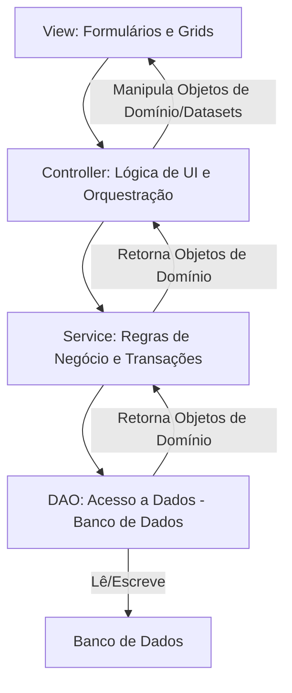

# testWK
# Projeto de Pedido de Vendas
Este documento detalha a arquitetura, as camadas e a estrutura do banco de dados do projeto de Pedido de Vendas, desenvolvido em Delphi. O objetivo é fornecer uma visão clara do sistema, facilitando a manutenção e futuras expansões.

## 1. Visão Geral do Projeto
O projeto "Pedido de Vendas" é uma aplicação desenvolvida em Delphi que visa gerenciar o processo de registro e consulta de pedidos. A aplicação segue um padrão de arquitetura limpa, promovendo a separação de responsabilidades e a manutenibilidade do código.

## 2. Arquitetura do Sistema: Camadas
A arquitetura do projeto é dividida em camadas lógicas, onde cada camada possui responsabilidades bem definidas, comunicando-se de forma controlada para garantir a coesão e baixo acoplamento.

### 2.1. Diagrama de Camadas
Aqui está um diagrama que ilustra a interação entre as principais camadas da aplicação:

